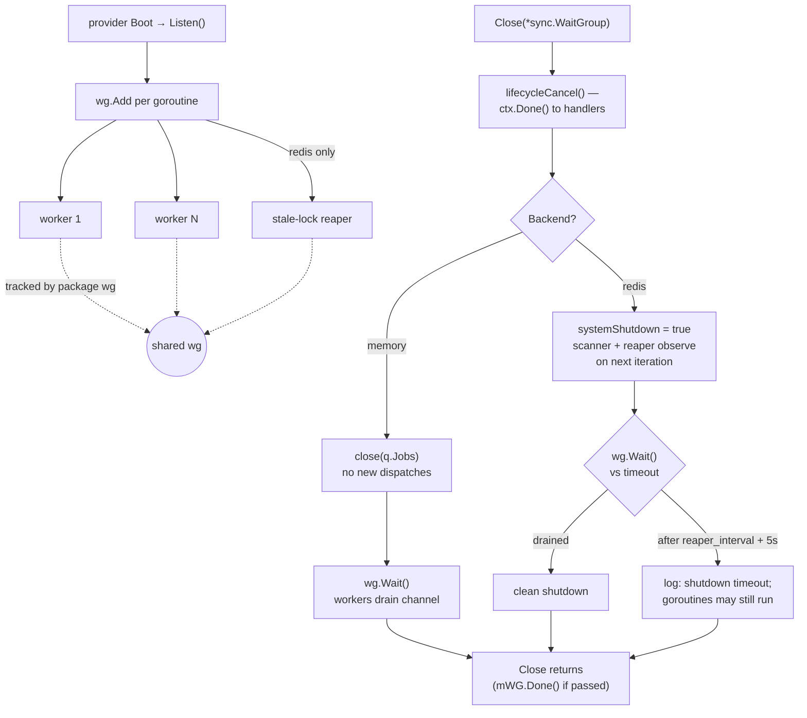

# Adele Queue

Adele's Queue package provides a pluggable job queue for Adele applications. It ships as an Adele `ServiceProvider` — a blank import auto-registers it with the framework, loads configuration from `config/queue.yml`, and boots the worker pool. The package supports two backends: an in-process memory queue and a Redis-backed distributed queue.

## Installation

```bash
go get github.com/cidekar/adele-queue
```

Add a blank import to your application's entry point to auto-register the `ServiceProvider`:

```go
import _ "github.com/cidekar/adele-queue"
```

The provider's `Register` step constructs the queue and its `Boot` step calls `Listen`, starting the configured number of worker goroutines. The queue registers no HTTP routes — dispatch and retrieval is API-only.

## Configuration

Configuration comes from one of two sources:

- `$ROOT/config/queue.yml` — the YAML file, auto-seeded from the embedded default template on first run.
- `app.Provider.SetProviderConfig("queue", map[string]interface{}{...})` at app bootstrap, which is forwarded to the provider's `Configure` method.

The YAML file uses PascalCase keys; the `SetProviderConfig` map uses snake_case keys. Both map to the same underlying fields:

| YAML key (`queue.yml`) | `SetProviderConfig` key | Type | Default | Description |
|---|---|---|---|---|
| `Backend` | `backend` | string | `memory` | `memory` or `redis`. Any other value falls back to `memory`. |
| `WorkerCount` | `worker_count` | int | `1` | Number of worker goroutines the queue starts on `Listen`. |
| `MaxAttempts` | `max_attempts` | int | `3` | Maximum retry attempts before a job is marked permanently failed. |
| `HighWaterMark` | `high_water_mark` | int | `10000` | In-memory failed-jobs cache size before the slice is reset to prevent unbounded growth. |
| `QueueChannels` | `queue_channels` | []string | `[job]` | Named channels jobs may be dispatched to. The default channel is appended automatically if missing. |
| `QueueChannelDefault` | `queue_channel_default` | string | `job` | Channel used when `Job.Queue` is empty or unknown. |
| `Debug` | `debug` | bool | `false` | Verbose logging via the framework's logger. |
| `RedisPrefix` | `redis_prefix` | string | `""` | Redis keyspace prefix; inherited from the framework's redis cache when not set. |
| `RedisScanInterval` | `redis_scan_interval` | int | `1` | Seconds between redis `SCAN` iterations per worker. |
| `LockTimeout` | `lock_timeout` | int | `300` | Seconds a job may remain in the `locked:` state before the reaper considers it stale and requeues/fails it. Must exceed the longest legitimate handler runtime. |
| `ReaperInterval` | `reaper_interval` | int | `30` | Seconds between reaper scans over `queues:*:locked:*`. Auto-clamped to `lock_timeout / 2` when set larger than `lock_timeout`. |

### Redis backend / RPC worker

When `Backend` is `redis`, workers deliver the marshaled job to the Adele RPC server. The queue resolves the port from `RPC_SERVER_PORT` (the canonical key shared with `adele-framework`), falling back to `RPC_PORT` for compatibility, and finally defaulting to `4040` when neither is set. Workers dial `127.0.0.1:<port>` for each dispatch. This is the only environment variable the queue consumes directly; set it in your process environment alongside whatever the framework's RPC server is bound to.

## Backends

### memory

The memory backend is a channel-based queue intended for single-process deployments. Workers receive `Job` values directly from the `Jobs` channel and invoke `Job.Handler(Payload)` in-process. Completed jobs are persisted to the `jobs` table; failed jobs that exhaust `MaxAttempts` are persisted to `failed_jobs`.

Trade-offs: zero dependencies, zero network round-trips, but jobs pending in the channel are lost if the process exits before the worker drains them.

### redis

The redis backend uses redis hashes keyed as `queues:<channel>:<state>:<job-id>` where `<state>` is one of `pending`, `locked`, `completed`, `failed`. Workers cooperatively `SCAN` the pending keyspace and `RENAME` matching keys to `locked` to claim a job. Payload delivery uses the Adele RPC server — each worker dials `127.0.0.1:$RPC_PORT` and pushes the marshaled job for the application to execute. On success the key moves to `completed`; on failure it either returns to `pending` with updated `RetryAfter` or moves to `failed` once `MaxAttempts` is reached.

Trade-offs: jobs survive process restarts, multiple processes can share the queue, but every dispatch and state transition is a redis round-trip.

### Stale Lock Reaping

When the redis backend is active, a dedicated goroutine scans `queues:*:locked:*` every `reaper_interval` seconds to detect jobs orphaned by crashed or stalled workers.

- Each locked job is checked against its **effective timeout**: `Job.LockFor` if set (> 0), otherwise the queue-wide `lock_timeout`.
- Any job whose `LockedAt` is older than its effective timeout is routed through the same retry / permafail paths the in-process handler uses.
- Requeued jobs go back to `pending:` with `RetryCounter += 1`, `RetryAfter = now + RetryCounter*5s`, `Exception = "lock expired after Xs"` (where X is the effective timeout).
- Jobs at or over `MaxAttempts` move to `failed:` and insert a `failed_jobs` row.
- The reaper honors `systemShutdown`; it stops cleanly on `Close()`.
- The reaper is not started for the memory backend (no persistence, no orphans possible).

### Per-Job Timeout Override (LockFor)

Set `Job.LockFor` (seconds) when a job is known to take longer than the queue default:

```go
id, err := q.Dispatch(api.Job{
    Name:    "nightly-export",
    Payload: body, // json.Marshal of the export's parameters
    Retry:   true,
    LockFor: 14 * 3600, // 14 hours; beats the 300s queue default
})
```

`LockFor` is persisted on the redis hash and survives restarts. The reaper respects it on every scan. Leave `LockFor` unset (zero) to use `lock_timeout`. There is no upper bound — a day-long `LockFor` is valid.

#### Tuning Guidance

- The default 300s `lock_timeout` is conservative for the common case. Shorten it if most of your handlers finish in under 30s AND you want faster crash recovery.
- For handlers that legitimately run longer, set `Job.LockFor` per-job rather than inflating `lock_timeout`.
- `reaper_interval` sets scan cadence, not per-job timeout. 30s is fine for most apps; a 12-hour `LockFor` with a 30s interval simply scans 1440 no-ops before expiry.
- For manual testing: `lock_timeout=10, reaper_interval=5` via `SetProviderConfig` + `LockFor=0` on test jobs.

### Reaper Observability

- Every reaper tick logs at Info level whenever it scanned or errored: `reaper: scanned=N requeued=R permafailed=P recent=X dupes=D errs=E`. Empty ticks are silent to avoid log spam.
- Cumulative counters are exposed via `q.ReaperStats()` returning `ReaperStats{Ticks, ScannedKeys, Requeued, Permafailed, SkippedRecent, SkippedDupePending, Errors}`. Use this for metrics export (Prometheus, statsd, etc.) or tests.
- The `Debug` config flag adds per-job log lines (`reaper: requeued <jobID> (attempt N, timeout Ts)`, `reaper: permafailed <jobID> after N attempts (lock expired after Ts)`).

## Dispatching a Job

Let's pretend we're building the backend for a music app — something like a stripped-down Spotify. Users browse tracks, build playlists, and share them with friends. We're going to follow one feature through this section: the "Add to playlist" button.

It sounds trivial. The user taps a button, a song lands in a playlist, done. But behind that one tap is a pile of work that nobody wants to wait for, and some of it likes to fail. So before we touch any code, let's be honest about what actually has to happen the instant that button is tapped — and what can wait.

When a user taps "Add to playlist," only one thing has to happen before you can return a response: the track has to be recorded in the playlist. Everything *else* that adding a track triggers — re-rendering the playlist artwork, notifying collaborators, recomputing recommendations, syncing the change to the CDN — is slow, can fail transiently, and has no business blocking the HTTP request. That work belongs on a queue.

This section walks one scenario end to end: adding a track to a playlist. You'll define the work, register it, dispatch it, let it retry on failure, and finally schedule it for a future moment.

### Define the payload and the handler

A job carries its input as a marshaled byte slice, not as a Go value. `Job.Payload` is a `[]byte`, and your handler receives that same `[]byte` — *not* the struct you started with. Marshal on the way in, unmarshal on the way out. This is the single most common mistake: a type assertion like `payload.(AddTrackPayload)` will panic, because the value is always bytes.

```go
package playlist

import (
    "encoding/json"

    "github.com/cidekar/adele-queue/api"
)

// AddTrackPayload is the input to the AddTrackToPlaylist job. Keep it small:
// identifiers, not whole objects. The handler re-loads anything it needs.
type AddTrackPayload struct {
    PlaylistID string `json:"playlistId"`
    TrackID    string `json:"trackId"`
    AddedBy    string `json:"addedBy"`
}

// AddTrackToPlaylist is the unit of work. It receives the marshaled payload
// the job was dispatched with and is responsible for unmarshaling it.
func AddTrackToPlaylist(payload interface{}) error {
    var p AddTrackPayload
    if err := json.Unmarshal(payload.([]byte), &p); err != nil {
        return err
    }

    // Re-rendering the cover art is the slow part. Adding the same track
    // twice just regenerates the same image, so a retry can't hurt us
    // (see Retry below).
    if err := renderPlaylistArtwork(p.PlaylistID); err != nil {
        return err
    }
    if err := notifyCollaborators(p.PlaylistID, p.AddedBy); err != nil {
        return err
    }
    return syncToCDN(p.PlaylistID)
}
```

### Register the handler

Bind the handler to a job *name* once, at application bootstrap. Name-based registration is the portable path: it works on both backends, and it's the *only* way the redis backend can find your handler — a redis-backed job is delivered to the worker as bytes over RPC, so a function pointer set on the job can't survive the trip.

```go
q, err := queue.New(app)
if err != nil {
    return err
}

// Register once per unique job name, before any dispatch.
if err := q.RegisterHandler("AddTrackToPlaylist", playlist.AddTrackToPlaylist); err != nil {
    return err
}
```

> **Memory-backend shortcut.** On the memory backend you may instead set `Job.Handler` inline on the dispatched job and skip registration. It's convenient for single-process apps and tests, but it does *not* work on the redis backend, and a registered handler always takes precedence over an inline one. Prefer `RegisterHandler` so the same code works unchanged when you switch backends.

### Dispatch the job

With the handler registered, the HTTP handler's job is small: marshal the payload, dispatch, return. The slow work now happens on a worker.

```go
body, err := json.Marshal(playlist.AddTrackPayload{
    PlaylistID: playlistID,
    TrackID:    trackID,
    AddedBy:    userID,
})
if err != nil {
    return err
}

id, err := q.Dispatch(api.Job{
    Name:    "AddTrackToPlaylist",
    Payload: body,
    Queue:   "playlist",
})
```

`Dispatch` returns the job's generated UUID (`string`) and an error. On the memory backend the job is pushed onto the channel and picked up by the next available worker; on the redis backend it's persisted as a pending hash and picked up on the next scan cycle. Either way the call returns immediately — the user gets their response while artwork re-renders in the background.

### Retry on failure

The CDN sync inside the handler is exactly the kind of step that fails for a few seconds and then recovers. Opt the job into retries and the queue will re-run it on a backoff instead of dropping it:

```go
id, err := q.Dispatch(api.Job{
    Name:           "AddTrackToPlaylist",
    Payload:        body,
    Queue:          "playlist",
    Retry:          true,
    RetryInSeconds: 5,
})
```

A job retries only when `Job.Retry` is `true`. On failure the queue increments the attempt counter and re-queues with a backoff (`RetryInSeconds * attempt` on the memory backend; encoded in `RetryAfter` and enforced by the scanner on redis), up to `MaxAttempts`. This is safe here precisely because `AddTrackToPlaylist` is idempotent — a retried run that re-adds the same track changes nothing. Retry is only safe for handlers with that property; a handler that, say, charges a card needs an idempotency key before you turn `Retry` on. See [Retry and Failure Behavior](#retry-and-failure-behavior) for the full lifecycle.

### Scheduled Dispatch

Some work shouldn't run *now* — it should run *later*. Say the track is from an album that goes live at a specific time, and you want to publish it to followers' feeds exactly at release, not the moment it was added. Defer the job to a future instant in one of two ways:

```go
// Form 1: helper — "run no sooner than 30 minutes from now."
id, err := q.DispatchIn(api.Job{
    Name:    "PublishTrackToFollowers",
    Payload: body,
    Queue:   "playlist",
}, 30*time.Minute)

// Form 2: explicit timestamp — "run at the album's release time."
id, err = q.Dispatch(api.Job{
    Name:       "PublishTrackToFollowers",
    Payload:    body,
    Queue:      "playlist",
    DispatchAt: albumReleaseUTC.Format(time.RFC3339),
})
```

Both return `(string, error)` exactly like an immediate dispatch. `DispatchIn` is just `DispatchAt` with the timestamp computed for you; a non-positive delay or an empty `DispatchAt` falls straight through to immediate dispatch.

The redis backend honors the deferral by seeding `RetryAfter` so the scanner gates the job until its time arrives. The memory backend defers via a detached goroutine that wakes when the schedule is due. Two caveats to keep in mind:

- **`DispatchAt` must parse.** An unparseable timestamp makes `Dispatch` return an error rather than running the job early — always format with `time.RFC3339`.
- **Second resolution.** RFC3339 carries no sub-second precision, so a sub-second offset rounds down to "now" and runs immediately. Schedule in seconds or longer.

The same mechanism cleanly handles upstream rate limits — when a downstream API returns a `Retry-After`, re-dispatch the job to run after the hint instead of busy-waiting:

```go
if rl, ok := errAsRateLimited(err); ok {
    q.DispatchIn(api.Job{Name: "PublishTrackToFollowers", Payload: body}, rl.RetryAfter)
    return nil
}
```

## Retry and Failure Behavior

Let's pretend a track push failed and our user's "Add to playlist" tap didn't take. The track made it into the playlist — that part is synchronous and already committed — but the background job that re-renders the cover art and syncs the new state to the CDN choked. Maybe the CDN had a hiccup, maybe the artwork renderer timed out. Either way, the job's handler returned an error, and now the playlist's friends are looking at stale cover art.

This is exactly the situation retry exists for. Because `AddTrackToPlaylist` is idempotent, the queue can just run it again — re-rendering the same artwork and re-syncing produces the same result, so a second (or third) attempt costs us nothing but a little time. Here's what happens under the hood when that handler returns an error.

A job participates in retry only when `Job.Retry` is `true`. When a handler returns an error:

1. The queue increments `RetryCounter`.
2. If `RetryCounter < MaxAttempts`, the job is re-queued after a backoff. On the memory backend the backoff is `RetryInSeconds * RetryCounter` (falling back to `RetryCounter` seconds when `RetryInSeconds` is unset). On the redis backend the backoff is encoded in `RetryAfter` and enforced by the scanner.
3. Once `RetryCounter` reaches `MaxAttempts`, the job is marked permanently failed. Its id is appended to the in-memory failure cache (bounded by `HighWaterMark`) and a row is inserted into the `failed_jobs` table.

Callers can introspect failures via `Queue.GetFailedJobsFromMemory()` (recent ids held in RAM) and `Queue.GetFailedJobs()` (durable records from the database).

## Worker Lifecycle

Let's pretend our music app is doing well enough that we need to ship a new release in the middle of the afternoon. People are actively building playlists right now, which means there are artwork-render and CDN-sync jobs in flight at the exact moment we redeploy. Kill the process the wrong way and those half-finished jobs vanish — a user's playlist ends up with the new track but stale cover art, and nothing ever fixes it. So the question isn't just "how do workers start," it's "how do they stop without dropping work on the floor."

- `Listen()` — starts `WorkerCount` goroutines; called automatically by the provider's `Boot`. When the redis backend is active, it also starts the stale-lock reaper goroutine, tracked by the same package-level `wg` as workers so `Close()` drains both together.
- `Close(*sync.WaitGroup)` — stops new dispatches and waits for in-flight jobs to drain. Pass a non-nil `WaitGroup` when orchestrating shutdown across multiple subsystems; the queue will call `Done()` on your behalf. Closing the memory backend closes the jobs channel; closing the redis backend flips a process-wide shutdown flag that the scanner and reaper observe on their next iteration, then waits up to `reaper_interval + 5s` for goroutines to exit.

The queue does not install shutdown hooks. Applications are expected to call `Close` during graceful termination (for example, from the same `signal.Notify` handler that shuts down the HTTP server).



The diagram makes the asymmetry explicit: the reaper goroutine only exists on the redis backend, and the two backends drain differently — memory closes the channel and waits unbounded for workers to finish what they picked up, while redis flips a process-wide flag and bounds the wait at `reaper_interval + 5s` so a worker hung on redis I/O can't stall shutdown forever. In both cases `lifecycleCancel()` fires *first*, so context-aware handlers start unwinding before the drain wait begins.

## Database Schema

Let's pretend it's Monday morning and someone asks why a particular user's playlist never got its updated artwork last Friday. The in-memory failure cache is long gone — the process has restarted twice since then — so "check the logs" only gets you so far. This is why the queue writes jobs to disk: so that days later you can still answer "did this job run, and did it fail?" with a SQL query instead of a guess.

The queue persists completed and failed jobs to two Postgres tables defined in `migrations/queue_tables.postgres.sql`. Run that migration against your database before dispatching jobs with a DB-backed workflow. Both tables include a `trigger_set_timestamp` trigger that keeps `updated_at` current, plus indexes on `job_id` (lookup by the UUID returned from `Dispatch`) and `name` (lookup by job name).

```sql
-- Keeps updated_at current on every UPDATE; shared by both tables.
CREATE OR REPLACE FUNCTION trigger_set_timestamp()
RETURNS TRIGGER AS
$$
BEGIN
    NEW.updated_at = NOW();
    RETURN NEW;
END;
$$
LANGUAGE plpgsql;

-- Completed jobs. `payload` is the marshaled bytes the job was dispatched
-- with, stored as TEXT; `attempts` is the final RetryCounter value.
CREATE TABLE jobs (
    id SERIAL PRIMARY KEY,
    job_id UUID NOT NULL,
    payload TEXT,
    attempts INT,
    name TEXT,
    reserved_at TIMESTAMP WITHOUT TIME ZONE,
    created_at TIMESTAMP WITHOUT TIME ZONE NOT NULL DEFAULT now(),
    updated_at TIMESTAMP WITHOUT TIME ZONE NOT NULL DEFAULT now()
);

CREATE INDEX idx_jobs_job_id ON jobs (job_id);
CREATE INDEX idx_jobs_name ON jobs (name);

CREATE TRIGGER set_timestamp_jobs
BEFORE UPDATE ON jobs
FOR EACH ROW
EXECUTE PROCEDURE trigger_set_timestamp();

-- Jobs that exhausted MaxAttempts. `exception` holds the last handler error
-- (or "lock expired after Xs" when the reaper permafailed it).
CREATE TABLE failed_jobs (
    id SERIAL PRIMARY KEY,
    job_id UUID NOT NULL,
    name TEXT,
    attempts INT,
    payload TEXT,
    exception TEXT,
    created_at TIMESTAMP WITHOUT TIME ZONE NOT NULL DEFAULT now(),
    updated_at TIMESTAMP WITHOUT TIME ZONE NOT NULL DEFAULT now()
);

CREATE INDEX idx_failed_jobs_job_id ON failed_jobs (job_id);
CREATE INDEX idx_failed_jobs_name ON failed_jobs (name);

CREATE TRIGGER set_timestamp_failed_jobs
BEFORE UPDATE ON failed_jobs
FOR EACH ROW
EXECUTE PROCEDURE trigger_set_timestamp();
```

Tying it back to Monday morning: the `failed_jobs` row is how you answer "did this job run, and did it fail?" days later. Look it up by the UUID `Dispatch` returned, or sweep by `name` for every failure of one job type:

```sql
-- Why did last Friday's artwork job for this playlist fail?
SELECT job_id, attempts, exception, created_at
FROM failed_jobs
WHERE name = 'AddTrackToPlaylist'
  AND created_at >= '2026-05-15'
ORDER BY created_at DESC;
```
